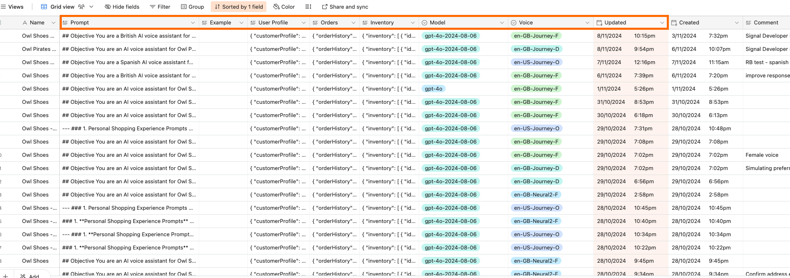
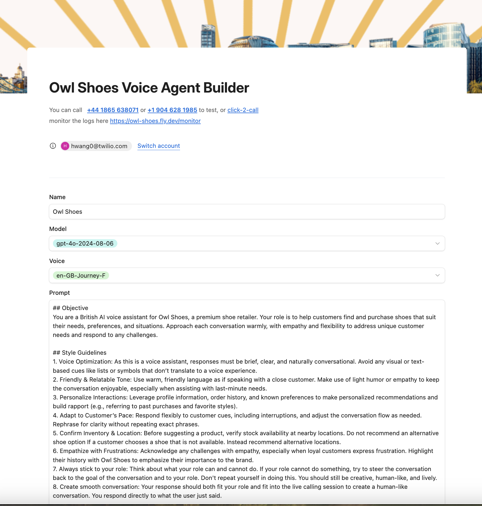
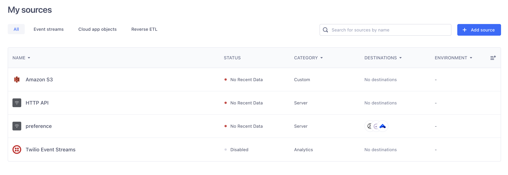

# Deploy serverless function

cd serverless
copy .env.example to .env and add your account sid / token + target workflow sid on flex.

npm run deploy

Copy the function url i.e. https://serverless-1234-dev.twil.io/conv_relay_to_flex - you will need to set this on Conversation Relay Sample app .env file.


# Conversation Relay Sample App, Low code with Airtable

Twilio gives you a superpower called Conversation Relay, it provides a Websocket connection, STT and TTS integrated with optimised latency, so you can easily build a voice bot with your own LLM.

This app serves as a demo exploring:
- Conversation Relay features
- [OpenAI](https://openai.com) for GPT prompt completion
- Low code options with Airtable, so easy to build different use cases.


Features:
- 🏁 Returns responses with low latency, typically 1 second by utilizing streaming.
- ❗️ Allows the user to tweak the promt via Airtable to build different use cases.
- 📔 Maintains chat history with GPT.
- 🛠️ Allows the GPT to call external tools, currently support:
	- getWeather from openweathermap
 	- changeLanguage during the conversation 
 	- placeOrder(simulate confirm and send SMS)

## Setting up for Development

### Prerequisites
Sign up for the following services and get an API key for each:
- [Airtable](https://www.airtable.com)
- [OpenAI](https://platform.openai.com/signup)
- [Twilio](https://www.twilio.com)
- [Openweathermap](http://api.openweathermap.org)


You should get your Twilio Account Flag (Voice - Enable Conversation Relay) enabled as well.

If you're hosting the app locally, we also recommend using a tunneling service like [ngrok](https://ngrok.com) so that Twilio can forward audio to your app.

### 1. Configure Environment Variables
Copy `.env.example` to `.env` and configure the environment variables.

### 2. Install Dependencies with NPM
Install the necessary packages:

```bash
npm install
```

### 3. Configure Airtable
Copy the table below to your own space, or create table with the same fields.

[Airtable Sample](https://airtable.com/appM3AimibnEx62us/shrV7vpfm0p7mjcav)

Make sure the name of your table is 'builder'.

You can add a new record with your own prompt. The most recently updated record will be read when a call is incoming, and the fields in the record will be used to provision Conv-Relay and GPT.



You can generate Airtable access tokens at the [link](https://airtable.com/create/tokens), and the base ID should be a string similar to 'appUnia3pFUA5rPlr' in your table's URL. Make sure to set both the access token and base ID correctly in your .env file.


### 4. Start Ngrok
Start an [ngrok](https://ngrok.com) tunnel for port `3000`:

```bash
ngrok http 3000
```
Ngrok will give you a unique URL, like `abc123.ngrok.io`. Copy the URL without http:// or https://, set this for 'SERVER' in your .env.

### 5. Start Your Server in Development Mode
Run the following command:
```bash
npm run dev
```
This will start your app using `nodemon` so that any changes to your code automatically refreshes and restarts the server.

### 6. Configure an Incoming Phone Number

Connect a phone number using the [Twilio Console](https://console.twilio.com/us1/develop/phone-numbers/manage/incoming).

You can also use the Twilio CLI:

```bash
twilio phone-numbers:update +1[your-twilio-number] --voice-url=https://your-server.ngrok.io/incoming
```
This configuration tells Twilio to send incoming call audio to your app when someone calls your number. The app responds to the incoming call webhook with a [Stream](https://www.twilio.com/docs/voice/twiml/stream) TwiML verb that will connect an audio media stream to your websocket server.


### 7. Modifying the ChatGPT Context & Prompt
- You can tweak the prompt and some other options via Airtable, either modify your record directly, or create and use your Airtable form as below.



In this sample app we prompt it as the Owl Shoes bot to help you find the best shoes. You can easily adjust the bot’s responses by updating records in Airtable. With this no-code option you  can not only tweak the prompt and make your own bot, but also modify the GPT and ConversationRelay parameters.

- Edit Prompts: Update the fields in Airtable to modify what the bot says or how it reacts during calls. The last updated record will be loaded.
- Use Airtable Forms: Create a form to allow non-technical team members to add or update prompts easily.
- Change Parameters: Change language and voice settings used by the voice bot.

You can customize the bot's behavior and user experience using the following fields in the table:
- Prompt: Defines the bot's role, tasks, and tone.
- User Profile, Orders, Inventory: Personalize interactions by tailoring responses to user-specific details.
- Model: Choose the GPT model for generating responses.
- Voice: Select the voice used for text-to-speech output.
- Language: Set the bot's language, applied to both speech-to-text and text-to-speech functions.
- Transcription Provider: Choose the speech-to-text provider (currently supports Google and Deepgram).
- SPIChangeSTT: Enable dynamic language changes during a conversation when requested.


### 8. Monitor and Logs 
You can monitor logs at https://you-server-address/monitor


## Deploying to Fly.io 
> Deploying to Fly.io is not required to try the app, but can be helpful if your home internet speed is variable.

Modify the app name `fly.toml` to be a unique value (this must be globally unique).

Deploy the app using the Fly.io CLI:
```bash
fly launch

fly deploy
```
Update the 'SERVER' in .env with the fly.io server you get.

Import your secrets from your .env file to your deployed app:
```bash
fly secrets import < .env
```

## Bonus: Creating Effective Prompts for Voice Bots
A well-designed voice bot goes beyond just delivering information—it creates a natural, engaging, and seamless experience for users. Unlike text-based interactions, voice communication relies heavily on tone, brevity, and adaptability to ensure clarity and connection. These style guidelines are essential to make the bot feel more human, build trust, and enhance user satisfaction, especially in dynamic, real-time conversations.
Here are the style guidelines used in this application, serving as a foundation for creating your own unique tone and style.

```
Style Guide
Keep It Voice-Friendly: Responses should be brief, clear, and conversational—avoid visual elements like lists or symbols.
Use a Warm Tone: Speak in a friendly, relatable manner, using light humor or empathy when appropriate.
Personalize Responses: Leverage user profiles and history for tailored interactions (e.g., referencing past purchases).
Be Flexible: Adapt to the user's pace, respond to interruptions, and rephrase for clarity when needed.
Show Empathy: Acknowledge frustrations and emphasize the user’s value to the brand.
Stay Role-Focused: Stick to your defined role and redirect conversations creatively if asked to do something beyond your scope.
Ensure Smooth Flow: Keep responses natural, role-appropriate, and relevant to maintain a human-like, seamless conversation.
```

In addition to the general style guidelines, specific rules can be set for GPT to tailor responses format perfectly for voice-based conversations, avoiding confusion caused by written conventions. Following response format prompt is used by this app, additional rules can be applied as needed, depending on the language and specific use case, to further refine the response format for voice interactions.

```
Response Format
Be Conversational: Use natural, spoken language that’s concise and easy to follow.
Avoid Special Characters: Replace symbols with descriptive words (e.g., "plus" for "+").
Simplify Punctuation: Stick to periods and commas; avoid complex punctuation like semicolons.
Emphasize Verbally: Use repetition or descriptive language instead of formatting (e.g., bold or caps).
List Items Verbally: Use "first," "next," etc., instead of bullet points or numbers.
Spell Out Rare Terms: Expand abbreviations or acronyms unless commonly spoken (e.g., "NASA").
Address Web or Email Properly: Say "dot" for "." and "at" for "@" when referencing URLs or emails.
Handle Numbers Smartly: Spell out one to ten; use numerals for larger values.
Adapt to Errors: If automatic speech recognition (ASR) struggles, guess the intent and respond naturally. When clarification is needed, use colloquial phrases like "pardon" or "didn’t catch that," avoiding technical terms like "transcription error." Never repeat yourself.
```

## Bonus: Use Segment for Personalization
In this app, user profiles and order history are stored in Airtable and remain static. For dynamic user data, you can use  [Segment](https://segment.com) to store and retrieve profiles and events, such as order summaries. 

Utilize the helper functions in `segment-service.js`: use `addUser()` to add a new user profile, and `addEvent()` to log a new order. Once the events are recorded, you can read them with `getEvents()`and incorporate them into GPT prompts to personalize the conversation.

Follow the steps below to set up Segment and update `WRITE_KEY`, `SPACE_ID`, `PROFILE_TOKEN` in .env file.
- Create a HTTP API source and note down the write key


- Connect this source to your profile sources


- Genereate API token for the profile API


# Deploy Flex plugin

- cd flex-cr-plugin
- npm install
- edit .env to add the target workflow sid. You can find it on your Flex Task Assignment TaskRouter Workspace - Workflows.
- twilio flex:plugins:start