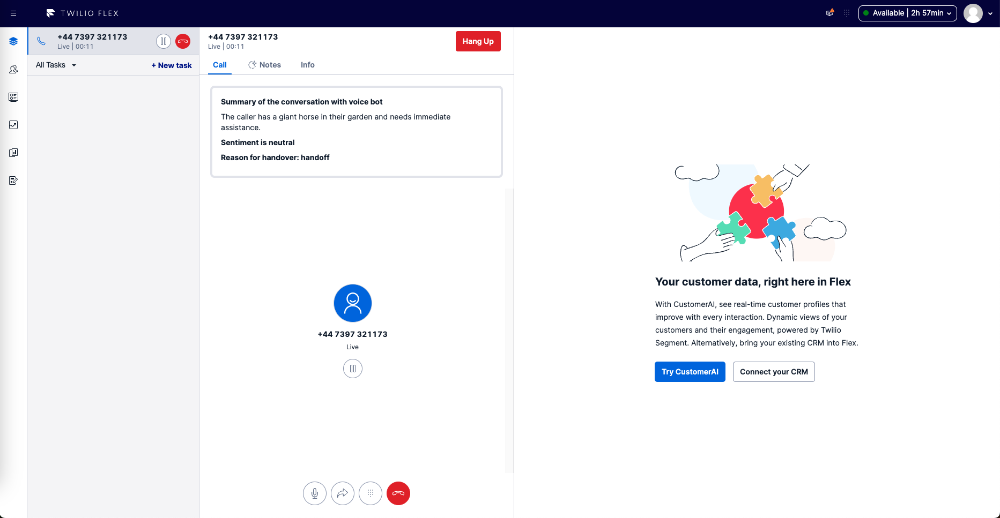
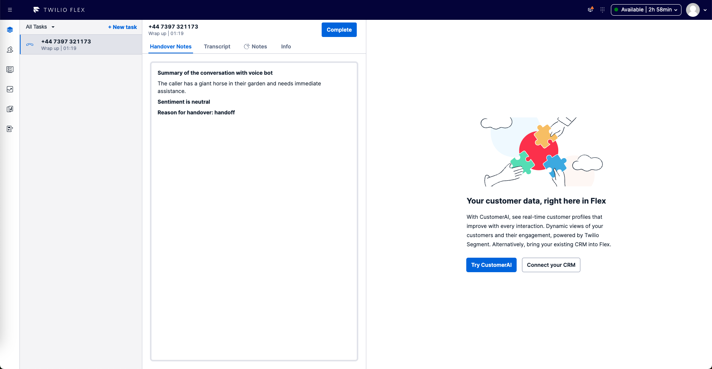

# Flex Conversation Relay Plugin

This plugin demonstrates how to present data from Conversation Relay in Flex when there is a handoff to the contact center. It will display 3 task attributes in the agent desktop, namely: callSummary, reason and sentiment. This plugin was styled using Twilio Paste. Here's how it looks when the call is accepted:



We can also present these attributes during wrapup.



## Setup

Make sure you have [Node.js](https://nodejs.org) as well as [`npm`](https://npmjs.com). We support Node >= 10.12 (and recommend the _even_ versions of Node). Afterwards, install the dependencies by running `npm install`:

```bash
cd 

# If you use npm
npm install
```

Next, please install the [Twilio CLI](https://www.twilio.com/docs/twilio-cli/quickstart) by running:

```bash
brew tap twilio/brew && brew install twilio
```

Finally, install the [Flex Plugin extension](https://github.com/twilio-labs/plugin-flex/tree/v1-beta) for the Twilio CLI:

```bash
twilio plugins:install @twilio-labs/plugin-flex
```


## Development

Run `twilio flex:plugins --help` to see all the commands we currently support. For further details on Flex Plugins refer to our documentation on the [Twilio Docs](https://www.twilio.com/docs/flex/developer/plugins/cli) page.
